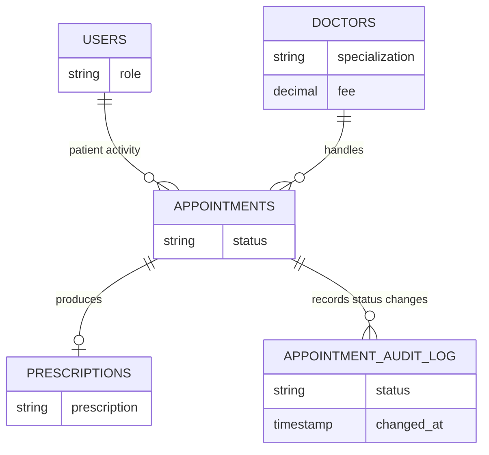

# CareGrid — Integrated Healthcare Operations Platform

CareGrid is a full-stack healthcare operations platform for managing doctors, patients, appointments, payments, specialist routing, email notifications, and prescription workflows through role-based interfaces.

It combines a React frontend with a Node.js/Express backend and MySQL database, along with Razorpay for payment collection, Gemini AI for symptom-to-specialist routing, Nodemailer for appointment notifications, and jsPDF for prescription downloads.

---

## ✨ Features

### 🔐 Role-Based Access Control

Three application roles are supported:

- **Admin**
- **Doctor**
- **Patient**

Each role has its own dashboard and protected application flow.

### 🛠️ Admin Dashboard

- Register and remove doctors
- View appointments across the system
- Monitor dashboard statistics
- Track doctor, patient, appointment, and pending counts

### 👨‍⚕️ Doctor Dashboard

- View incoming appointment requests
- Approve or cancel appointments
- Write prescriptions for approved appointments
- Mark appointments as completed through the prescription workflow
- View profile and appointment statistics

### 👤 Patient Portal

- Browse doctors and their specializations
- View consultation fee information
- Describe symptoms through the AI Symptom Checker
- Receive an AI-assisted specialist recommendation
- Book appointments with Razorpay test-mode payments
- Cancel pending appointments
- View and download prescriptions as PDF

### 🤖 AI-Assisted Specialist Routing

Patients can describe their symptoms and receive a specialist recommendation using the Google Gemini API.

> The AI feature is intended for **specialist routing assistance**, not medical diagnosis.

### 💳 Payment Integration

Razorpay test-mode integration is used for appointment payment collection.

### 📧 Automated Email Notifications

Patients receive automated email notifications when a doctor approves or cancels an appointment.

### 📄 Prescription PDF Generation

Completed prescriptions can be generated and downloaded as PDF documents using jsPDF.

---

## 🧰 Technology Stack

| Layer | Technology |
|---|---|
| **Frontend** | React 19, Vite 8, Tailwind CSS v4 |
| **Routing** | React Router v7 |
| **HTTP Client** | Axios |
| **Backend** | Node.js, Express 5 |
| **Database** | MySQL 8+ with `mysql2` |
| **Authentication** | Role-based authentication with client-side auth state |
| **Payments** | Razorpay (test mode) |
| **AI Routing** | Google Gemini 2.5 Flash API |
| **Email** | Nodemailer with Gmail SMTP |
| **PDF Generation** | jsPDF |

---

## 🏗️ Architecture

CareGrid follows a client-server architecture where the React frontend communicates with the Node.js/Express backend through REST APIs.

The backend acts as the central application layer for business logic, database operations, authentication flow, and third-party integrations.

```text
                        ┌──────────────────────┐
                        │   React + Vite UI    │
                        │  Tailwind CSS        │
                        └──────────┬───────────┘
                                   │
                                   │ REST / Axios
                                   ▼
                        ┌──────────────────────┐
                        │  Node.js + Express   │
                        │   Application API    │
                        └───────┬───────┬──────┘
                                │       │
                  ┌─────────────┘       └─────────────────┐
                  ▼                                       ▼
        ┌──────────────────┐                    ┌──────────────────┐
        │   MySQL 8+       │                    │ External Services │
        │ Database         │                    │                  │
        └──────────────────┘                    │ • Razorpay       │
                                                │ • Gemini API      │
                                                │ • Nodemailer      │
                                                └──────────────────┘
```

### Core Application Flow

```text
Patient / Doctor / Admin
          ↓
     React Client
          ↓
      REST API
          ↓
 Node.js / Express
      ↙       ↘
   MySQL    External APIs
```

---

## 🗄️ Database Design

The database is documented around the core healthcare entities described by the project:

- `users`
- `doctors`
- `appointments`
- `prescriptions`
- `appointment_audit_log`

### Database Relationship Diagram



> **Note:** This is a high-level relationship diagram based on the entities documented for the project. The SQL file remains the source of truth for the exact columns, keys, constraints, indexes, views, procedures, and triggers.

### Database Design Highlights

- **4 core tables:** `users`, `doctors`, `appointments`, `prescriptions`
- **Audit logging:** `appointment_audit_log` records appointment status changes
- **Indexes:** indexes are defined for frequently queried data
- **Views:** reporting views are provided for appointment, doctor, patient, and daily appointment data
- **Stored procedures:** database procedures support booking, doctor creation, dashboard data, and appointment completion workflows
- **Triggers:** database triggers support audit logging, booking validation, and timestamp management

For the complete schema and SQL implementation, see:

**[Database Documentation](Hospital%20management%20system.sql)**

---

## 📂 Project Structure

```text
CareGrid/
│
├── hms-backend/                 # Express API server
│   ├── server.js               # Backend routes and business logic
│   ├── .env                    # Local credentials (not committed)
│   └── .env.example            # Environment variable template
│
├── hms-frontend/               # React + Vite frontend
│   ├── src/
│   │   ├── pages/              # Main application pages
│   │   ├── components/         # Reusable UI components
│   │   └── services/           # API client and service logic
│   ├── .env                    # Local frontend environment
│   └── .env.example            # Environment variable template
│
├── Hospital management system.sql
└── README.md
```

---

## 🚀 Getting Started

### Prerequisites

- Node.js **18+**
- MySQL **8+**
- A Razorpay test account
- A Gmail account with an App Password enabled
- A Google AI Studio / Gemini API key

### 1. Database Setup

Import the SQL file into MySQL:

```bash
mysql -u root -p < "Hospital management system.sql"
```

This initializes the `Hospital_HMS` database and its required database objects.

### 2. Local Demo Accounts

The seed data includes demo accounts for the supported application roles.

| Role | Email | Password |
|---|---|---|
| Admin | `admin@hms.com` | `admin123` |
| Doctor | `ramesh@hms.com` | `doc123` |
| Patient | `rahul@hms.com` | `pat123` |

> These credentials are intended for local development using the bundled seed data. Do not use them for a public deployment.

### 3. Backend Setup

```bash
cd hms-backend
npm install
cp .env.example .env
```

Configure the backend `.env`:

```env
DB_HOST=localhost
DB_USER=root
DB_PASSWORD=your_mysql_password
DB_NAME=Hospital_HMS
PORT=5000

EMAIL_USER=your_gmail@gmail.com
EMAIL_PASS=your_gmail_app_password

GEMINI_API_KEY=your_gemini_api_key

RAZORPAY_KEY_ID=rzp_test_your_key_id
RAZORPAY_KEY_SECRET=your_razorpay_key_secret
```

Start the backend:

```bash
npm start
```

The API runs on:

```text
http://localhost:5000
```

### 4. Frontend Setup

```bash
cd hms-frontend
npm install
cp .env.example .env
```

Configure the frontend `.env`:

```env
VITE_API_URL=http://localhost:5000/api
VITE_RAZORPAY_KEY_ID=rzp_test_your_key_id
```

Start the frontend:

```bash
npm run dev
```

The application runs on:

```text
http://localhost:5173
```

---

## 🔒 Security

- **Environment variables:** Secrets and credentials should remain in `.env` files and must not be committed.
- **Razorpay credentials:** The `key_id` may be client-facing as required by Razorpay, while the `key_secret` must remain backend-only.
- **AI input handling:** Avoid sending sensitive patient information through the symptom input to external AI services.
- **Code execution / input controls:** Application-level validation should not be treated as a substitute for production-grade isolation or security controls.

### Current Authentication Limitation

The current version does not use JWT-based authentication or server-side session storage. Authentication state is maintained through the current application/client flow.

For a production deployment, authentication should be strengthened with secure server-managed sessions or token-based authentication, password hashing, authorization checks, and additional security controls.

---

## ⚙️ Engineering Highlights

### Role-Based Workflows

Different application roles receive different dashboards and actions, keeping administrative, doctor, and patient workflows separated.

### Database-Backed Operations

Core healthcare operations such as appointments, doctors, users, and prescriptions are persisted in MySQL.

### Auditable Appointment Changes

Appointment status changes are recorded through the audit-log mechanism, providing a history of workflow changes.

### External Service Integration

The backend integrates with multiple external services while keeping their credentials in environment configuration:

```text
Express Backend
    ├── MySQL
    ├── Razorpay
    ├── Gemini API
    └── Nodemailer
```

### Database-Level Logic

The SQL layer includes indexes, views, stored procedures, and triggers to support application workflows and reporting.

---

## ⚠️ Current Limitations

- Passwords in the current seed/authentication implementation require stronger protection before production use.
- No JWT or server-side session management is currently implemented.
- Patient self-registration is supported, while doctors are added through the admin workflow.
- Appointment lists do not currently use pagination.
- The single-prescription-per-appointment rule is not enforced at the database level.
- Razorpay is configured for test mode.

---

## 📚 Documentation

- **[Database Schema](Hospital%20management%20system.sql)** — complete database definition and seed data
- **Source Code** — `hms-backend/` and `hms-frontend/`

---

## 👤 Author

**Sachin Kumar**  
B.Tech CSE (AI/ML)

[GitHub](https://github.com/sachinkumar-git) · [LinkedIn](https://www.linkedin.com/in/sachin-sde)

---

## 📄 License

This project is intended for academic, portfolio, and learning purposes.
